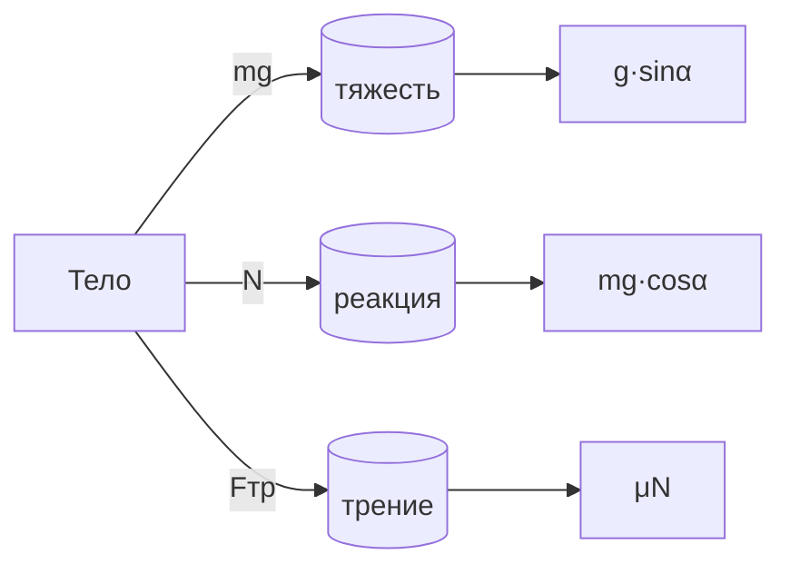

# Сравнение поля силы тяжести и однородного электростатического поля
```
| Левая колонка | Центральная колонка | Правая колонка |
|:--------------|:-------------------:|---------------:|
| Текст         | Текст               | Текст          |
```

| Характеристика поля    |                                                                                                 Поле силы тяжести                                                                                                 |                                                                                                                                                                                                                                                                                Однородное электростатическое поле |
| :--------------------- | :---------------------------------------------------------------------------------------------------------------------------------------------------------------------------------------------------------------: | ----------------------------------------------------------------------------------------------------------------------------------------------------------------------------------------------------------------------------------------------------------------------------------------------------------------: |
| Сила                   |                                                                                   Сила тяжести $m \vec{g}$, консервативная сила                                                                                   |                                                                                                                                                                                                                                                          Электростатическая сила $q \vec{E}$, консервативная сила |
| Силовая характеристика |                                                                                      Ускорение свободного падения $\vec{g}$                                                                                       |                                                                                                                                                                                                                                                                  Напряженность электростатического поля $\vec{E}$ |
| Работа                 | Работа при перемещении тела массой $m$ не зависит от траектории, а зависит только от положения начальной и конечной точек траектории. Работа силы тяжести при перемещении тела по замкнутой траектории равна нулю |                                                                                                Работа при перемещении заряда $q$ не зависит от траектрории, а только от положения начальной и конечной точек траектории. Работа электростатической силы при перемещении заряда по замкнутой траектории равна нулю |
| Энергия                |                      Для определения потенциальной энергии надо выбрать нулевой уровень ее отсчета. При подъеме тела на высоту $h$ над этим уровнем потенциальная энергия равна $W_{п}=mgh$                       | Для определения потенциальной энергии заряда в электростатическом поле надо выбрать нулевой уровень отсчета. При смещении положительно заряда относитльено нулевого уровня отсчета в направлении, противоположносм направлению напряженности на $\Delta d$, потенциальная энергия заряда равна $W_{п}=qE\Delta d$ |
| Потенциал              |                                                                                                         -                                                                                                         |                                                                                                                                                                                                    Потенциал $\phi=\frac{A}{q}=\frac{W_{п}}{q}$. Считается, что на бесконечности потенциальная энергия равна нулю |

---

# Пример блок-схемы
```
	```mermaid
	graph LR
	    A[Тело] -->|mg| B[(тяжесть)]
	    A -->|N| C[(реакция)]
	    A -->|Fтр| D[(трение)]
	    B --> E[g·sinα]
	    C --> F[mg·cosα]
	    D --> G[μN]
	```
```

